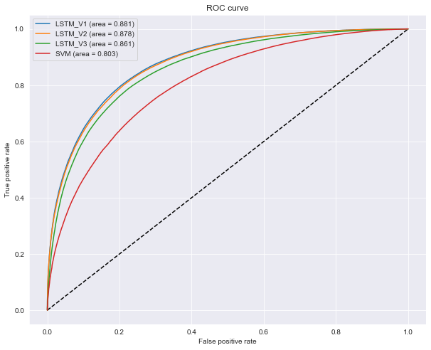

# 😄😐😡 Analiza sentymentu na podstawie [Sentimental140](http://help.sentiment140.com/for-students)

## 📝 Cel projektu

Celem projektu było stworznie module, który byłby w stanie na podstawie tekstu odczytać emocje z niego płynące. Innymi słowy, czy tekst ma zabarwienie pozytywne czy negatywne.

## 🏗 Testowane architektury

- `SVM` z jądrem `rbf` korzystający z różnych parametrów. Najlepsza konfiguracja została odnaleziona za pomocą algorytmu `grid search`.
- Trzy różne modele sieci neuronowych korzystające z `LSTM`:
  - **`LSTM_V1`**
  ```
  Layer (type)                 Output Shape              Param #
  =================================================================
  embedding_1 (Embedding)      (None, 50, 300)           73362000
  _________________________________________________________________
  dropout_1 (Dropout)          (None, 50, 300)           0
  _________________________________________________________________
  lstm_1 (LSTM)                (None, 100)               160400
  _________________________________________________________________
  dense_1 (Dense)              (None, 1)                 101
  =================================================================
  Total params: 73,522,501
  Trainable params: 160,501
  Non-trainable params: 73,362,000
  _________________________________________________________________
  ```
  - **`LSTM_V2`**
  ```
  Layer (type)                 Output Shape              Param #
  =================================================================
  embedding_2 (Embedding)      (None, 50, 300)           73362000
  _________________________________________________________________
  spatial_dropout1d_1 (Spatial (None, 50, 300)           0
  _________________________________________________________________
  conv1d_1 (Conv1D)            (None, 46, 64)            96064
  _________________________________________________________________
  bidirectional_1 (Bidirection (None, 128)               66048
  _________________________________________________________________
  dense_2 (Dense)              (None, 512)               66048
  _________________________________________________________________
  dropout_2 (Dropout)          (None, 512)               0
  _________________________________________________________________
  dense_3 (Dense)              (None, 512)               262656
  _________________________________________________________________
  dense_4 (Dense)              (None, 1)                 513
  =================================================================
  Total params: 73,853,329
  Trainable params: 491,329
  Non-trainable params: 73,362,000
  _________________________________________________________________
  ```
  - **`LSTM_V3`**
  ```
  Layer (type)                 Output Shape              Param #
  =================================================================
  embedding_3 (Embedding)      (None, 50, 32)            7825280
  _________________________________________________________________
  spatial_dropout1d_2 (Spatial (None, 50, 32)            0
  _________________________________________________________________
  lstm_3 (LSTM)                (None, 50)                16600
  _________________________________________________________________
  dropout_3 (Dropout)          (None, 50)                0
  _________________________________________________________________
  dense_5 (Dense)              (None, 1)                 51
  =================================================================
  Total params: 7,841,931
  Trainable params: 7,841,931
  Non-trainable params: 0
  _________________________________________________________________
  ```
  Z czego dwa pierwsze korzystając z modelu `word2vec`, który został wcześniej na danych wejściowych. Natomiast trzeci model uczy się embeddingu na bieżąco.

## ⚙️ Zawartość projektu

- [preprocessing](https://github.com/lukmccall/psi-project/blob/master/preprocessing.ipynb) skrypt opisujący proces oczyszczania danych oraz uczenia modelu `word2vec`. Należy wykonać go na początku.
- [svm](https://github.com/lukmccall/psi-project/blob/master/svm.ipynb) skrypt tworzący i uczący model `SVM` pochadzący z `sklearn`. Uczenie go zajmie bardzo dużo czasu. Dlatego też, zalecam zmiejeszenie danych wejściowych przy testowaniu programu.
- [neural_network](https://github.com/lukmccall/psi-project/blob/master/neural_network.ipynb) skrypt tworzący i uczący trzy modele sieci rekurencyjnych z biblioteki `TensorFlow` z wykorzystaniem `Kerasa`. Tak samo jak w przypadku `SVM'a` proces ten jest czasochłonny. Zalecane jest uczenie na karcie graficznej a nie na procesorze. W skrypcie znajduje się informacja z jakiej jednoski liczącej korzysta program.
- [summary](https://github.com/lukmccall/psi-project/blob/master/summary.ipynb) skrypt zbierający i prezentujący wyniki wszystkich 4 modeli. Na końcu zaprezentowane jest również działanie algorytmy `word2vec`.

## 🕵️‍♂️ Porównanie wyników



Na powyższym rysunku znajduje się wykres porównujący wszystkie 4 modele. Łatwo możemy zauważyć, że algorytm oznaczony jako **`LSTM_V1`** sprawdza się najlepiej. Bardziej szczegółowa analiza znajduje się w pliku [summary](https://github.com/lukmccall/psi-project/blob/master/summary.ipynb).

## 🚀 Jak uruchomić projekt

1. Sklonuj reposytorium

   ```sh
   $ git clone https://github.com/lukmccall/psi-project.git
   ```

2. Pobierz plik z danymi z strony http://help.sentiment140.com/for-students i umieść go w folderze projektu.

3. Upewnij się, że masz zainstalową [Anaconde](anaconda.com).

4. W folderze projektu uruchmą następujące komendy:

   ```sh
   $ conda env create -f enviroment.yml
   $ conda activate sentimental140
   $ jupyter notebook
   ```

5. Otworzy Ci się przeglądarka, gdzie będziesz mógł wybrać odpowiedni skrypt. Pamiętaj, że na początku musisz odtworzyć i wykonać plik [preprocessing](https://github.com/lukmccall/psi-project/blob/master/preprocessing.ipynb). Stworzy on na dysku model `word2vec` oraz wyczyszczone dane.
